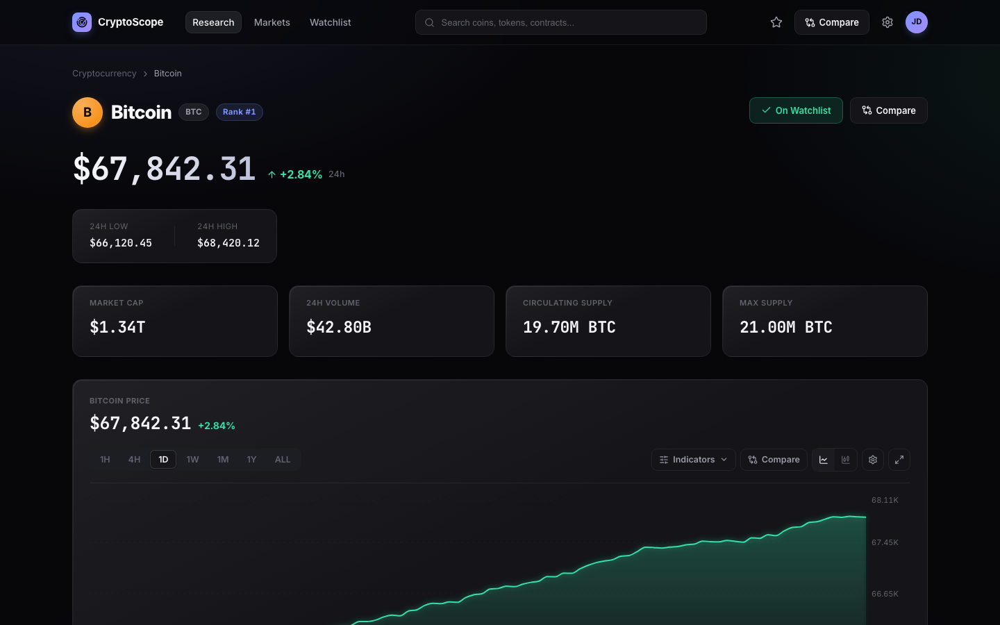
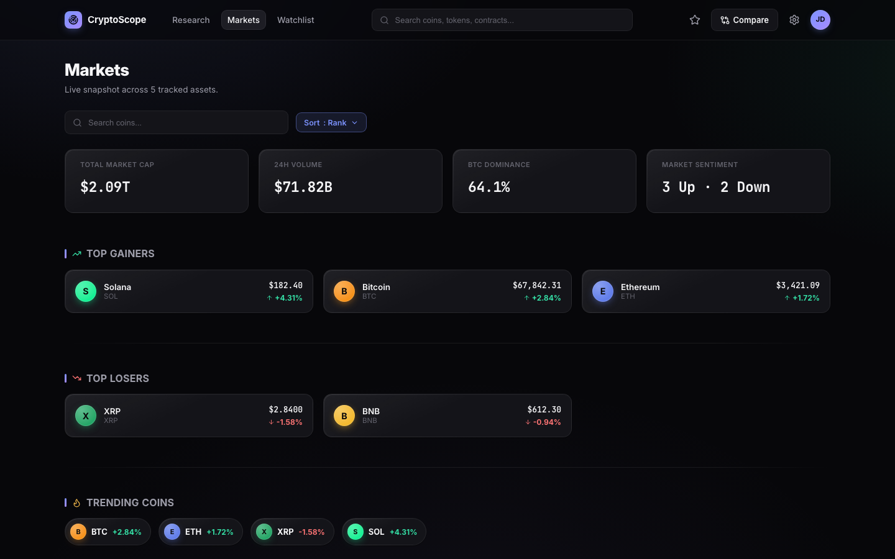
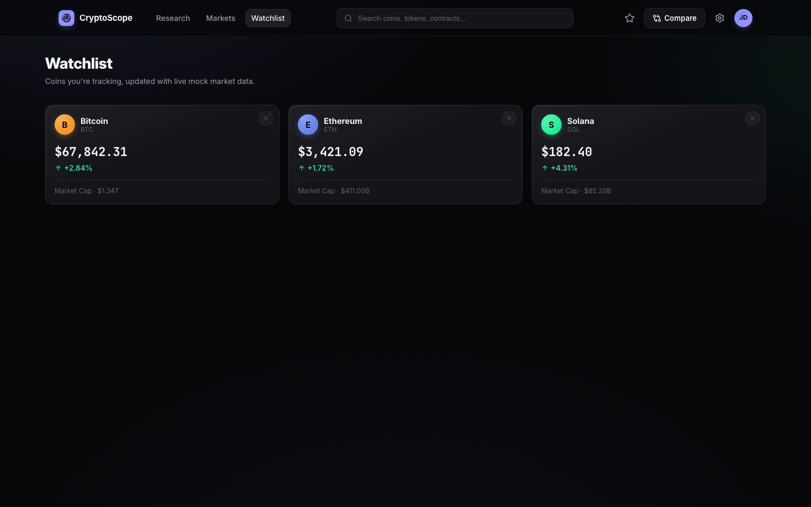

# CryptoScope

A polished, fully responsive cryptocurrency research dashboard built with React — a frontend showcase covering routing architecture, data visualization, a from-scratch design system, and GSAP-driven micro-interactions.

> Mock-data project: all prices/market stats come from a local mock dataset (`src/data/mockCoins.js`) served through an async service layer that mirrors a real REST API's shape, so swapping in a live backend later only touches `src/services/api.js`.

## Screenshots

| Research | Markets |
|---|---|
|  |  |

| Watchlist |
|---|
|  |

## Features

- **Three routed pages** — `/research/:coinId`, `/markets`, `/watchlist` — with a header nav whose active state tracks the current route, and a subtle page-transition on top-level navigation.
- **Coin research page** — animated price chart (line/candlestick, timeframe switcher, moving-average indicator, synced volume chart), key stats, holder distribution donut, token supply, and per-exchange market data across secondary tabs.
- **Markets overview** — aggregate stats (total market cap, 24h volume, BTC dominance, sentiment), top gainers/losers, trending coins, and a sortable/searchable, mobile-responsive coin table.
- **Watchlist** — add/remove coins from anywhere in the app; persisted to `localStorage`.
- **Global search & compare** — jump to any coin from the header search, or open a side-by-side comparison modal for up to three coins.
- **Design system** — CSS custom-property tokens (color, spacing, radius, shadow, gradients) driving a consistent dark, glass-panel UI across every component, with light/no extra dependencies (plain CSS, no Tailwind/UI kit).
- **Animation layer** — GSAP-powered scroll reveals, count-up numbers, tab/timeframe indicator tweens, and modal transitions, all routed through a single flag (`src/utils/animationConfig.js`) that can disable every JS-driven animation app-wide for debugging or reduced-motion needs, without touching the animation code itself.
- **Fully responsive** — dedicated mobile layouts (card-based table fallbacks, collapsible nav, adaptive charts) verified down to small phone widths.

## Tech Stack

| | |
|---|---|
| **UI** | React 19 |
| **Routing** | React Router 7 |
| **Build tool** | Vite 8 |
| **Charts** | Recharts |
| **Animation** | GSAP |
| **Icons** | lucide-react |
| **Styling** | Plain CSS with a custom design-token system (no CSS framework) |
| **Linting** | Oxlint |

## Project Structure

```
src/
├── components/        # One folder per component (JSX + co-located CSS)
│   ├── PriceChart/     # Chart, controls, tooltip, candle shape
│   ├── CoinHeader/, StatCard/, Card/, Button/, Tabs/, ...
│   └── ...
├── pages/              # Route-level pages (ResearchPage, MarketsPage)
├── context/            # AppContext — watchlist, compare state, coin selection
├── services/           # Mock async "API" layer
├── data/               # Mock coin + chart datasets
├── hooks/              # useReveal (scroll-in animation hook)
├── styles/             # Design tokens + shared layout classes
└── utils/              # Formatters + the animation on/off switch
```

## Routes

| Path | Page |
|---|---|
| `/` | Redirects to `/research/bitcoin` |
| `/research/:coinId` | Coin research dashboard (Overview / Markets / Holders / Supply tabs) |
| `/markets` | Global markets overview + coin table |
| `/watchlist` | Saved coins |

## Getting Started

**Prerequisites:** Node 18+

```bash
npm install
npm run dev       # start the dev server (http://localhost:5173)
npm run build     # production build to dist/
npm run preview   # preview the production build locally
npm run lint      # run Oxlint
```

## Notes on Architecture

- **URL as source of truth** — the "active coin" isn't duplicated in component state; it's derived from the `:coinId` route param (via `matchPath`) inside `AppContext`, so it can never drift out of sync with what's on screen.
- **Mock service layer** — every function in `services/api.js` returns a `Promise` on an artificial delay, so components already handle loading states correctly. Pointing them at a real backend is a drop-in change.
- **Design tokens** — every color, spacing value, radius, and shadow lives in `styles/tokens.css` as CSS custom properties, so the whole visual language can be retheme'd from one file.

## Author

Built by [Thulasi Aishwarya](https://github.com/thulasiaishu-08).
